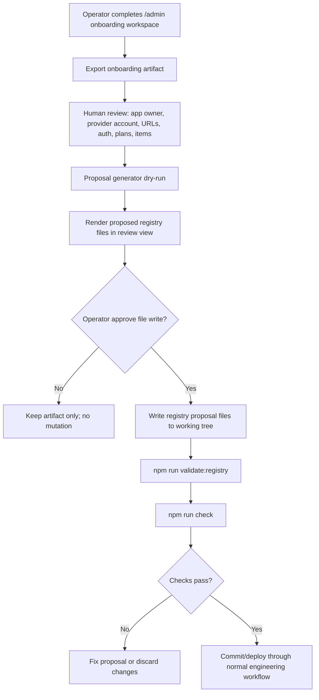

# Phase 7 Track 6D - Controlled Registry Proposal Generation Plan

Status: planned and accepted as the next safety gate after Track 6C.

## Objective

Define the safe path from a `/admin` onboarding artifact to reviewed PayGate registry package files.

Track 6D is a planning/control track. It does not write registry files, call Stripe, configure Vercel, deploy, enable live mode, create refunds, or grant entitlements.

## Why this track exists

Track 6B created the guided onboarding workspace. Track 6C hardened validation and export. The next risk is obvious: if PayGate jumps directly from exported JSON to file creation, the operator console could accidentally become a mutation tool without proper review.

Track 6D closes that gap by defining an explicit proposal workflow before any future apply/build step exists.

## Source artifact

The source is the exported onboarding artifact from `/admin`.

Required artifact fields:

- `status: draft_preview_only`
- `non_mutating: true`
- `app.app_id`
- `app.name`
- `app.provider_account`
- `app.auth_model`
- `origins.test`
- `origins.live`
- `return_contexts`
- `auth_boundary`
- `plans[]`
- `items[]` when item/SKU checkout is needed
- `environment_variable_names`
- `registry_proposal`
- `required_next_steps`

Rejected artifact fields or values:

- Stripe secret values such as `sk_test_`, `sk_live_`, `rk_test_`, `rk_live_`
- webhook secret values such as `whsec_`
- provider price IDs such as `price_...` in place of lookup keys
- arbitrary caller-controlled return URLs
- live-mode approval claims
- entitlement grants based only on browser return

## Target registry package mapping

The controlled proposal maps into this package shape:

```text
registry/apps/<app_id>/
  app.yaml
  plans.yaml
  entitlements.yaml
  integration.yaml
  integration-status.md
  files.manifest.yaml
  env.example
  items.yaml                # optional, only when item/SKU checkout is required
```

### `app.yaml`

Mapped from artifact:

| Registry field | Artifact source |
| --- | --- |
| `schema_version` | constant: `"1.0"` |
| `app_id` | `app.app_id` |
| `name` | `app.name` |
| `status` | initial proposal default: `draft` |
| `provider.type` | constant: `stripe` |
| `provider.account` | `app.provider_account` |
| `billing.enabled` | default: `true` after operator approval |
| `application_urls.test` | `origins.test` |
| `application_urls.live` | `origins.live` |
| `identity.user_reference` | `supabase_user_id` for `supabase_jwt` apps |

### `plans.yaml`

Mapped from `plans[]`:

| Registry field | Artifact source |
| --- | --- |
| `plan_key` | `plans[].plan_key` |
| `name` | `plans[].name` |
| `type` | `payment` maps to `one_time`; `subscription` maps to `subscription` |
| `pricing.currency` | `plans[].currency` |
| `pricing.unit_amount_minor` | `plans[].amount_minor` |
| `pricing.interval` | required only for subscription plans |
| `provider.stripe.lookup_key` | `plans[].provider_lookup_key` |
| `entitlement_bundle[]` | `plans[].entitlements[]` |
| `status` | proposal default: `draft`; operator may later approve `active` |

### `items.yaml` optional

Mapped from `items[]` only when item/SKU checkout is required:

| Registry field | Artifact source |
| --- | --- |
| `item_key` | `items[].item_ref` |
| `name` | `items[].name` |
| `type` | derived from `item_ref` namespace or operator-selected item type |
| `pricing.currency` | `items[].currency` |
| `pricing.unit_amount_minor` | `items[].amount_minor` |
| `provider.stripe.lookup_key` | `items[].provider_lookup_key` |
| `entitlement.key` | `items[].entitlement_key` |
| `entitlement.scope` | `items[].entitlement_scope` |
| `status` | proposal default: `draft`; operator may later approve selected item as `active` |

### `entitlements.yaml`

Proposal generator should include every entitlement key referenced by plans/items and keep app ownership clear.

Minimum proposal shape:

```yaml
schema_version: "1.0"
entitlements:
  - key: <app_id.feature_key>
    description: <operator-reviewed description>
    status: draft
```

### `env.example`

Generated from `environment_variable_names`, names only, no values.

Required rule: never write real secret values to `env.example`.

### `integration.yaml` and `integration-status.md`

Generated as non-authoritative onboarding documentation for the app repo integration boundary.

Required rule: app repository file changes must still obey that app package `files.manifest.yaml`.

## Controlled proposal workflow



## Approval gates

Before any future Track 6E implementation writes files, all of these must be true:

- Operator explicitly approves writing registry proposal files.
- Proposal target path is exactly `registry/apps/<app_id>/`.
- `<app_id>` is a safe identifier and does not overwrite an existing app unless the operator explicitly chose update mode.
- No secret-looking values exist in the artifact or generated files.
- Generated files contain lookup keys, not Stripe price IDs.
- Proposed return contexts map to registry allowlists only.
- App remains sandbox/test-first.
- Live mode remains a separate later approval gate.
- Refunds remain outside onboarding.
- Entitlement mutation remains evidence-based only.

## Future Track 6E implementation boundaries

A future controlled proposal generator may:

- parse a local exported onboarding artifact;
- generate proposed YAML/Markdown/env-example files;
- show a dry-run diff;
- write files only after explicit operator approval;
- run `npm run validate:registry` and `npm run check`;
- leave all Stripe/Vercel/live/refund actions manual and separate.

It must not:

- call Stripe;
- create Product/Price objects;
- read or write real secrets;
- edit Vercel environment variables;
- deploy automatically;
- activate live mode;
- grant entitlements;
- create refunds;
- modify app repositories outside approved manifest paths.

## Acceptance checklist

- [x] Define registry proposal file mapping from onboarding artifact.
- [x] Define operator approval gate before writing files.
- [x] Define validation commands required before commit/deploy.
- [x] Define rollback/review expectations for proposed registry changes.
- [x] Keep Stripe, Vercel env vars, live mode, refunds, and entitlements outside automatic apply.

## Next recommended track

Proceed to Phase 7 Track 6E - Controlled Registry Proposal Generator Dry-Run.

Track 6E should create a dry-run proposal tool or admin workflow that can transform an exported onboarding artifact into a reviewable file proposal without writing files by default.
