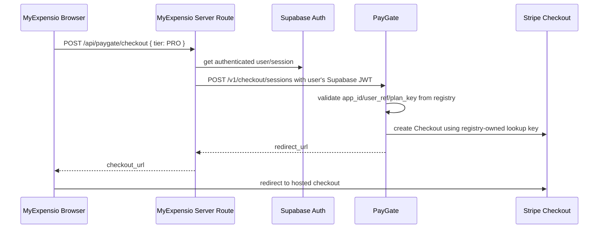

# Phase 7 Track 6O - MyExpensio Thin PayGate Client Plan and Code Prep

Status: complete as a code-prep plan. No MyExpensio code was changed in this track.

Purpose: prepare the MyExpensio app-side migration from direct Stripe checkout to PayGate for the first controlled Pro monthly sandbox slice, while preserving the existing MyExpensio billing system until PayGate sandbox proof is accepted.

## Scope boundary

Track 6O is a planning and code-prep track. It inspects the real MyExpensio billing surface and defines the safe implementation shape for the next track.

Included:

- Identify current MyExpensio billing files and route ownership.
- Define the thin PayGate client/proxy contract for Pro monthly sandbox checkout.
- Define app-side environment variables that are safe for MyExpensio.
- Define feature-flag and rollback strategy.
- Define the minimum file set for the next implementation track.
- Define how PayGate state should be read without trusting browser redirects.

Excluded:

- No MyExpensio source mutation in this track.
- No PayGate deployment.
- No Vercel env mutation.
- No Stripe product/price mutation.
- No checkout execution.
- No webhook proof.
- No direct database entitlement mutation.
- No removal of MyExpensio legacy Stripe routes.
- No Premium, ORG/workspace, live payment, or refund work.

## Track 6N precondition

Before implementing this plan, Track 6N evidence must be green:

- Stripe sandbox Price lookup key `myexpensio_pro_monthly` exists and is active.
- PayGate Vercel env includes MyExpensio Supabase JWT routing.
- PayGate `/diagnostics/ready` is ready.
- PayGate `/diagnostics/runtime` shows `myexpensio` in multi-app auth checks.
- PayGate `/admin/summary?app_id=myexpensio&environment=test` shows the MyExpensio registry package.

If Track 6N is not green, do not touch MyExpensio app code.

## Current MyExpensio billing surface inspected

The MyExpensio app currently owns direct Stripe billing routes.

| Area | Current file | Current behavior |
| --- | --- | --- |
| Settings billing UI | `apps/user/app/(app)/settings/billing/page.tsx` | Calls `/api/billing/checkout` and `/api/billing/portal`; displays Pro/Premium plans. |
| Upgrade page | `apps/user/app/(app)/upgrade/page.tsx` | Calls `/api/billing/checkout` for `PRO` or `PREMIUM`. |
| Direct checkout route | `apps/user/app/api/billing/checkout/route.ts` | Creates Stripe Checkout directly using `STRIPE_SECRET_KEY`, `STRIPE_PRICE_PRO`, `STRIPE_PRICE_PREMIUM`. |
| Direct portal route | `apps/user/app/api/billing/portal/route.ts` | Creates Stripe Customer Portal directly using `STRIPE_SECRET_KEY`. |
| Direct webhook route | `apps/user/app/api/billing/webhook/route.ts` | Processes Stripe events directly into MyExpensio `subscriptions`. |
| Billing summary route | `apps/user/app/api/billing/summary/route.ts` | Reads MyExpensio `subscriptions` table for UI state. |
| Subscription helpers | `apps/user/lib/subscription.ts` | Resolves tier/status and maps direct Stripe price IDs to `PRO`/`PREMIUM`. |

## First PayGate app-side slice

Only one slice is allowed for first implementation:

```text
app_id: myexpensio
plan_key: pro_monthly
MyExpensio tier mapping: PRO
environment: test
entity_type: USER only
currency/amount: registry-owned by PayGate, MYR 18/month
provider account: stripe:nhl_global_solution
```

Deferred:

- Premium monthly.
- ORG/workspace subscriptions.
- Portal migration.
- Reconciliation repair UI.
- Live payment.
- Refund automation.
- Legacy direct Stripe route removal.

## Thin PayGate client architecture

MyExpensio should not call PayGate directly from a browser with a static app token. The safe path is a server-side route in MyExpensio:



The server-side route should send the current user's Supabase access token to PayGate as the bearer token. PayGate validates it using the MyExpensio Supabase JWKS configured in Track 6N.

## Proposed MyExpensio env vars

These are safe MyExpensio application variables. They are not Stripe secrets and do not grant provider authority.

```ini
PAYGATE_BASE_URL=https://pay-gate-beta.vercel.app
PAYGATE_APP_ID=myexpensio
PAYGATE_ENVIRONMENT=test
PAYGATE_CHECKOUT_ENABLED=false
```

`PAYGATE_CHECKOUT_ENABLED=false` should remain the default until operator explicitly turns on the sandbox proof. The next implementation track can wire the route behind this flag.

Do not add any PayGate operator token, Stripe secret key, webhook secret, or provider price ID to browser-visible env vars.

## Proposed route contract

Create a new MyExpensio route in a later implementation track:

```text
POST /api/paygate/checkout
```

Request from MyExpensio UI:

```json
{
  "tier": "PRO"
}
```

Server-side mapping:

| MyExpensio request | PayGate request |
| --- | --- |
| `tier: PRO` | `plan_key: pro_monthly` |
| authenticated Supabase user id | `user_ref` |
| configured `PAYGATE_APP_ID` | `app_id: myexpensio` |
| configured `PAYGATE_ENVIRONMENT` | `environment: test` |
| fixed route context | `return_context: billing` |

Response back to existing UI should preserve the current shape where practical:

```json
{
  "checkout_url": "https://checkout.stripe.com/..."
}
```

That lets existing UI handlers continue redirecting without needing a large UI rewrite.

## UI switch strategy

For the first code implementation:

- Add PayGate route without deleting `/api/billing/checkout`.
- Update Pro-only buttons to call PayGate only when `PAYGATE_CHECKOUT_ENABLED=true` and the selected tier is `PRO`.
- Keep Premium on existing legacy direct Stripe route until a later registry/PayGate Premium track.
- Keep ORG/workspace subscriptions on existing/deferred path.
- Keep portal button on existing legacy direct Stripe route until PayGate portal migration is separately planned.

Recommended UI behavior:

| User action | During sandbox proof |
| --- | --- |
| Select Pro | Use PayGate route only if feature flag is on. |
| Select Premium | Keep legacy direct Stripe route or disable with clear deferred copy. |
| Manage subscription | Keep legacy portal route until PayGate portal proof is planned. |
| Return from checkout | Show pending/refresh message; do not grant state from URL alone. |

## PayGate state read plan

MyExpensio should eventually read PayGate state after checkout, but not trust the browser return page.

Later route candidate:

```text
GET /api/paygate/state
```

It should:

- authenticate the current user through Supabase;
- forward the Supabase access token to PayGate;
- request PayGate subscription/entitlement state for `app_id=myexpensio`, `user_ref=<user.id>`, `environment=test`;
- map PayGate state to MyExpensio UI copy;
- avoid direct entitlement grants from query string parameters.

The first implementation may defer state read if PayGate still needs a stable app-facing state endpoint for MyExpensio. In that case, checkout proof must stop at verified PayGate webhook/admin evidence, not UI unlock.

## Data and entitlement migration caution

Current MyExpensio gates read the app's own `subscriptions` table. PayGate stores provider-neutral Hub states separately.

Therefore, the first checkout proof must not assume MyExpensio's existing `subscriptions` table automatically updates from PayGate. A later track must choose one controlled bridge:

1. MyExpensio reads PayGate state directly for Pro feature gates; or
2. PayGate emits an explicit app-safe entitlement sync contract; or
3. MyExpensio keeps local subscription rows but only updates them from verified PayGate evidence, never from browser redirects.

Until that bridge is implemented, PayGate checkout success proves payment flow, webhook receipt, and Hub entitlement state, but not full MyExpensio feature unlock.

## Minimum files for next implementation track

Authorized candidate files for Track 6P, subject to a fresh check before editing:

- `apps/user/app/api/paygate/checkout/route.ts` - new server-side proxy route.
- `apps/user/app/(app)/settings/billing/page.tsx` - optional Pro checkout switch behind feature flag.
- `apps/user/app/(app)/upgrade/page.tsx` - optional Pro checkout switch behind feature flag.
- `apps/user/.env.billing.example` or docs equivalent - add non-secret PayGate app env examples.
- MyExpensio billing docs - document that Pro sandbox can route through PayGate while legacy Stripe remains fallback.

Do not modify:

- Stripe webhook route removal.
- Portal route migration.
- Subscription database schema.
- Premium checkout.
- ORG/workspace checkout.
- Mobile app checkout.

## Rollback strategy

Rollback must be one env flag:

```ini
PAYGATE_CHECKOUT_ENABLED=false
```

When false:

- Pro checkout uses the existing legacy MyExpensio `/api/billing/checkout` path.
- No PayGate checkout request is made.
- Existing MyExpensio behavior remains available.

## Verification plan for next implementation track

After implementing Track 6P later:

1. Confirm Track 6N evidence is green.
2. Set `PAYGATE_CHECKOUT_ENABLED=true` only in the chosen sandbox environment.
3. Login to MyExpensio as a sandbox user.
4. Start Pro checkout from Settings Billing or Upgrade page.
5. Confirm PayGate creates a Stripe sandbox Checkout Session for `myexpensio/pro_monthly`.
6. Complete Stripe sandbox payment.
7. Confirm PayGate webhook/admin evidence shows MyExpensio processed event.
8. Confirm no live payment and no Premium/ORG flow was touched.
9. Decide separately how MyExpensio feature unlock should read PayGate entitlement state.

## Track 6O checklist

- [x] Inspect MyExpensio AGENTS.md before app-side planning.
- [x] Inspect current MyExpensio billing UI and API route files.
- [x] Identify the current direct Stripe ownership path.
- [x] Define the thin PayGate server-side proxy architecture.
- [x] Define safe non-secret MyExpensio PayGate env vars.
- [x] Define Pro-only, sandbox-only feature flag strategy.
- [x] Define rollback strategy.
- [x] Define minimum candidate files for the next implementation track.
- [x] Keep MyExpensio code unchanged in this track.
- [x] Keep Premium, ORG/workspace, portal migration, live payment, and refunds deferred.

## Next documented step

Proceed to Phase 7 Track 6P - Implement MyExpensio Pro Sandbox PayGate Checkout Proxy.

Track 6P should edit MyExpensio only after Track 6N evidence is green and should implement a small server-side PayGate checkout proxy behind `PAYGATE_CHECKOUT_ENABLED`, preserving legacy Stripe checkout as rollback.
