# PayGate Product Roadmap Graph

Generated by `npm run graphify`.

```mermaid
flowchart TD
  P[Product Objective\nProvider-neutral multi-app payment gateway] --> G[Non-negotiable boundaries\nHub owns commercial authority, secrets, webhooks, entitlements, reconciliation]

  G --> PH0[Phase 0\nContract and authority freeze\nFrozen]
  PH0 --> PH1[Phase 1\nExecutable foundation\nFrozen]
  PH1 --> PH2[Phase 2\nStripe sandbox vertical slice\nFrozen]
  PH2 --> PH3[Phase 3\nAIntern integration\nFrozen]
  PH3 --> PH4[Phase 4\nProduction hardening\nFrozen]
  PH4 --> PH5[Phase 5\nLive-mode readiness\nFrozen]
  PH5 --> PH6[Phase 6\nControlled live pilot\nFrozen; refund deferred]
  PH6 --> PH7[Phase 7\nOperator console and multi-app scale-out\nCurrent governance cleanup]

  PH7 --> T71[Track 1\nOperator console UX shell\nImplemented]
  PH7 --> T72[Track 2\nApp #2 intake/classification\nCompleted]
  PH7 --> T74[Track 4\npageCast Cast Pass onboarding\nSandbox/test closed]

  T74 --> T4A[4A\nCast Pass USD 19/month setup\nDone]
  T4A --> T4B[4B\nRegistry activation/admin catalog\nDone]
  T4B --> T4C[4C\nSupabase JWT auth boundary\nDone]
  T4C --> T4D[4D\nThin PayGate client checkout\nDone]
  T4D --> T4E[4E\nSandbox checkout/webhook/entitlement proof\nAccepted]
  T4E --> T4F[4F\nEntitlement state display\nAccepted]
  T4F --> T4G[4G\nCast Pass access enforcement plan\nAccepted]
  T4G --> T4H[4H\nPremium Cast access enforcement\nVerified]
  T4H --> T4I[4I\nOperator/admin evidence polish\nDone]
  T4I --> T4J[4J\nSingle Cast item/SKU contract plan\nDone]
  T4J --> T4K[4K\npageCast onboarding closure packet\nDone]
  T4K --> T4L[4L\nMulti-app admin/monitoring verification\nAccepted]
  T4L --> T4M[4M\npageCast onboarding freeze/go-forward note\nPrepared]

  T4M --> T5A[Track 5A\nSingle Cast item/SKU registry contract\nDone]
  T5A --> T5B[Track 5B\nRegistry loader/domain types for items\nDone]
  T5B --> T5C[Track 5C\nitem_ref checkout contract behind disabled gate\nDone]
  T5C --> T5D[Track 5D\nprovider lookup resolution for item prices\nDone]
  T5D --> T5E[Track 5E\nitem checkout persistence and entitlement evidence\nDone]
  T5E --> T5F[Track 5F\nwebhook projection for item-scoped entitlements\nDone]
  T5F --> T5G[Track 5G\npageCast thin client for Single Cast checkout\nDone]
  T5G --> T5H[Track 5H\nitem entitlement access enforcement\nDone]
  T5H --> T5I[Track 5I\ncontrolled Single Cast sandbox E2E proof\nAccepted]
  T5I --> T5J[Track 5J\noperator item evidence and reconciliation review\nDone]

  T5J --> GOV[Governance cleanup\nPhase 6 frozen, pageCast not live, UI-driven onboarding required]
  GOV --> T6A[Track 6A\nUI-driven App Onboarding Workspace Plan\nDone]
  T6A --> T6B[Track 6B\nBuild onboarding workspace shell\nDone]
  T6B --> T6C[Track 6C\nOnboarding validation and export hardening\nDone]
  T6C --> T6D[Track 6D\nControlled registry proposal generation plan\nDone]
  T6D --> T6E[Track 6E\nControlled registry proposal generator dry-run\nDone]
  T6E --> T6F[Track 6F\nOperator approval gate for registry apply\nDone]
  T6F --> T6G[Track 6G\nEnd-to-end proposal apply rehearsal\nDone]
  T6G --> T6H[Track 6H\nReal app onboarding operator runbook and UI handoff\nDone]
  T6H --> T6I[Track 6I\nUI-driven onboarding freeze prep and first real-app candidate gate\nDone]
  GOV -.-> T5K[Track 5K\nSingle Cast live readiness gate\nDeferred unless explicitly approved]
  T6I --> T6J[Track 6J\nFirst real-app candidate intake and dry-run proposal\nAwaiting operator candidate]
  T6J --> F7[Phase 7 freeze prep\nAfter first candidate dry-run review]

  DEFER1[Deferred\npageCast Single Cast live/broad rollout]
  DEFER2[Deferred\npageCast live-mode payment readiness]
  DEFER3[Deferred\npageCast live payment/refund proof]
  DEFER4[Deferred\nitem-specific reconciliation repair automation]

  T5J -.-> DEFER1
  T5J -.-> DEFER2
  T5J -.-> DEFER3
  T5J -.-> DEFER4

  BLOCK[Blocked without explicit operator approval\nLive checkout, live payment, live refund, broad rollout] -.-> T5K
  BLOCK -.-> DEFER2
  BLOCK -.-> DEFER3
```

## Reading The Graph

- Phases 0-5 are frozen.
- Phase 6 is frozen with refund deferred by operator decision.
- Phase 7 is current and now in governance cleanup/freeze prep.
- pageCast Cast Pass sandbox/test onboarding is closed through Track 4L, with Track 4M freeze/go-forward note prepared.
- Track 5A through Track 5F built the PayGate item/SKU contract, registry loading, checkout gate, provider lookup, persistence, and verified webhook projection.
- Track 5G and Track 5H connected pageCast to the item contract and enforced scoped item access.
- Track 5I accepted one controlled Single Cast sandbox E2E proof for USD 9.99.
- Track 5J documented operator/admin item evidence and clarified that one-time Single Cast purchases are not subscription reconciliation failures.
- Track 5K is not automatic; pageCast live Stripe remains deferred.
- Track 6A defines the UI-driven App Onboarding Workspace Plan.
- Track 6B implemented the non-mutating onboarding workspace shell in /admin.
- Track 6C hardened onboarding validation/export and prepared the registry proposal handoff artifact.
- Track 6D defined the controlled path from onboarding artifact to reviewed registry proposal files.
- Track 6E implemented a non-mutating dry-run registry proposal generator.
- Track 6F implemented the explicit operator approval gate for registry apply/write mode.
- Track 6G rehearsed the dry-run to approved-apply cycle with a throwaway app in an isolated registry root.
- Track 6H documented the real-app onboarding operator runbook and UI handoff.
- Track 6I freeze-prepped the UI-driven onboarding workflow and defined the first real-app candidate gate.
- Track 6J is active but awaiting operator selection of one real app candidate before dry-run proposal review can be honestly completed.
- PayGate product completion requires guided UI-driven onboarding, not only manual docs and exported JSON.
